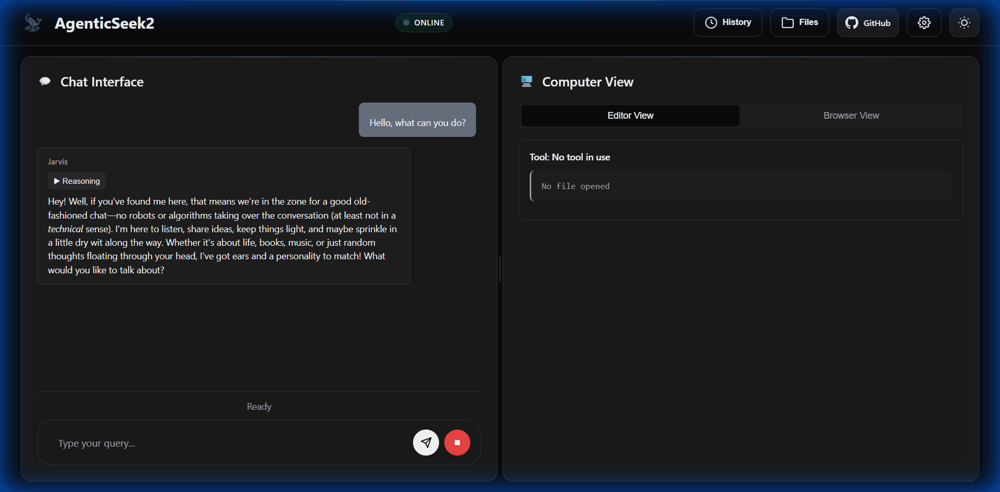
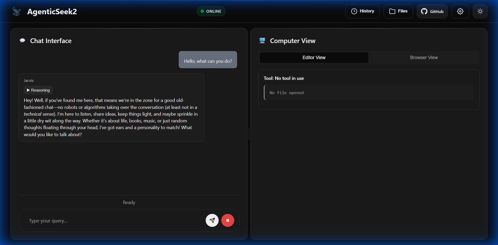
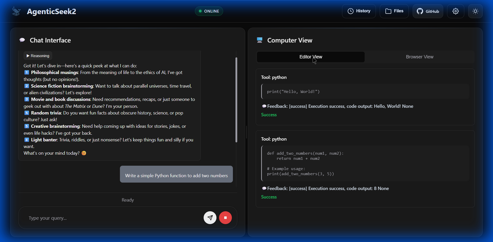
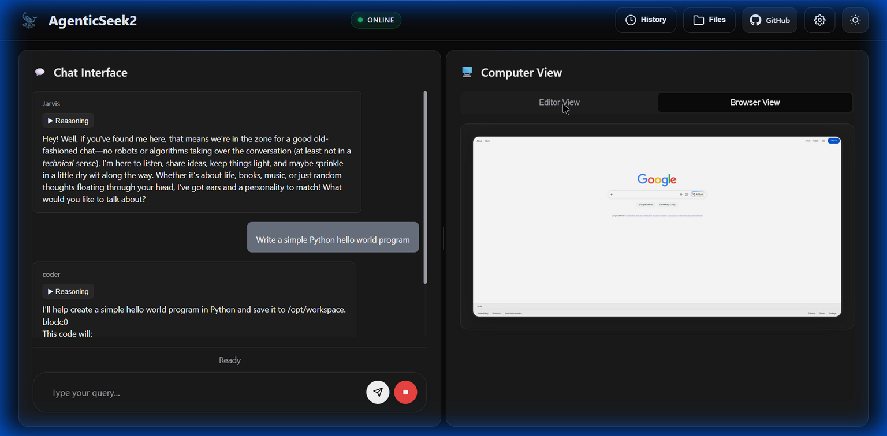
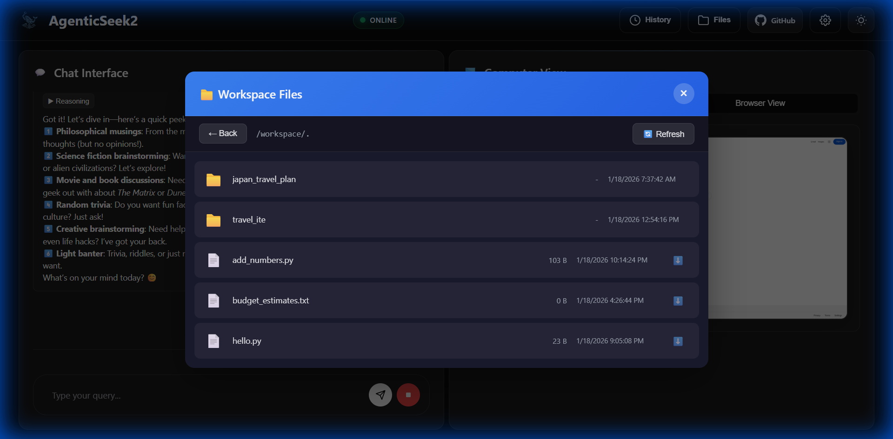
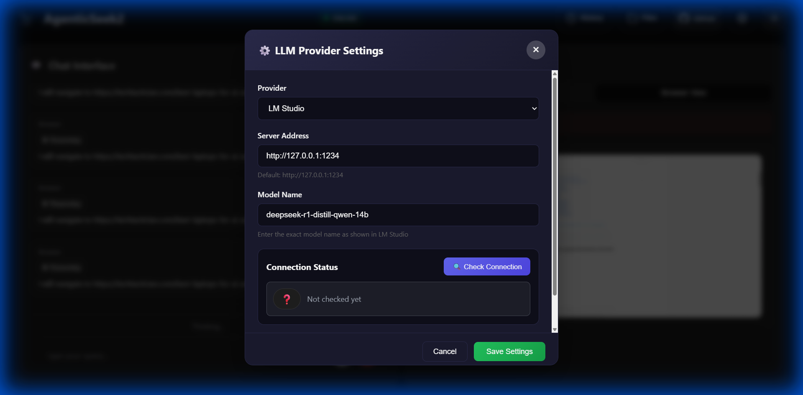
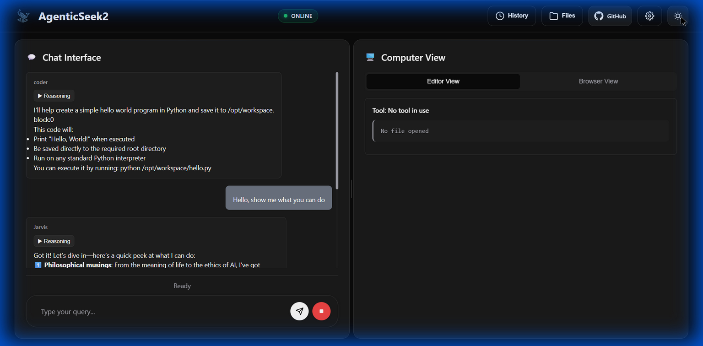

# 🚀 AgentSeek 2

<p align="center">

</p>

**A local AI assistant that browses the web, writes code, and plans tasks autonomously — all running on your hardware for complete privacy.**

> 🔒 100% Local • 🌐 Smart Web Browsing • 💻 Code Generation • 🧠 Multi-Agent System

---

## ✨ Demo

### 🎬 Animated Feature Tour
<p align="center">

</p>

*6 features shown: Chat → Editor → Browser → Files → LM Studio → Light Mode*

---

## 📸 Screenshots

### 🌙 Chat Interface (Dark Mode)
<p align="center">

</p>

*Natural conversation with Jarvis AI assistant!*

### 💻 Editor View - Code Generation & Execution
<p align="center">

</p>

*Python code generation with live execution output!*

### 🌐 Browser View - Web Browsing
<p align="center">

</p>

*Integrated web browser showing Google search!*

### 📁 Workspace Files Browser
<p align="center">

</p>

*Browse and manage your workspace files directly!*

### ⚙️ LM Studio Integration
<p align="center">

</p>

*Configure LM Studio as your local LLM provider with server address and model selection!*

### ☀️ Light Mode Theme
<p align="center">

</p>

*Toggle between dark and light themes!*

---

## 🎯 Features

| Feature | Description |
|---------|-------------|
| 🔒 **Fully Local** | Everything runs on your machine — no cloud, no data sharing |
| 🌐 **Web Browsing** | Autonomous search, read, and extract information from the web |
| 💻 **Code Assistant** | Write, debug, and run Python, JavaScript, Go, Java, and more |
| 🧠 **Smart Routing** | Automatically selects the best agent for your task |
| 📋 **Task Planning** | Breaks complex projects into manageable steps |
| 🎙️ **Voice Enabled** | Speech-to-text for hands-free interaction |
| 🌙 **Dark/Light Mode** | Beautiful UI with theme toggle |
| 📁 **File Browser** | Explore and manage workspace files |
| ⚙️ **LM Studio** | Local LLM integration with easy configuration |

---

## 🚀 Quick Start

### Prerequisites

- **Python 3.10.x** - [Download](https://www.python.org/downloads/release/python-3100/)
- **Docker Desktop** - [Windows](https://docs.docker.com/desktop/install/windows-install/) | [Mac](https://docs.docker.com/desktop/install/mac-install/)
- **Git** - [Download](https://git-scm.com/downloads)
- **LM Studio** - [Download](https://lmstudio.ai/) (for local LLM)

### Installation

```bash
# Clone the repository
git clone https://github.com/arpanguria68-ui/agenticseek2.git
cd agenticseek2

# Copy environment file
cp .env.example .env

# Start all services (Windows)
start start_services.cmd full

# Start all services (Mac/Linux)
./start_services.sh full
```

### Access the Web UI

Open your browser and go to: **http://localhost:3000**

---

## ⚙️ Configuration

Edit `config.ini` to set your LLM provider:

```ini
[MAIN]
is_local = True
provider_name = lm-studio
provider_model = deepseek-r1:14b
provider_server_address = http://127.0.0.1:1234
agent_name = Jarvis

[BROWSER]
headless_browser = True
stealth_mode = True
```

### Supported Providers

| Provider | Type | Description |
|----------|------|-------------|
| `lm-studio` | Local | LM Studio desktop app |
| `ollama` | Local | Self-hosted LLM server |
| `openai` | API | OpenAI GPT models |
| `google` | API | Google Gemini models |
| `deepseek` | API | Deepseek models |

---

## 📝 Example Usage

```
🎯 "Search the web for the latest AI news and summarize the top 3 articles"

💻 "Write a Python script to download images from a URL and resize them"

📁 "Find all PDF files in my Documents folder and list them by size"

🌐 "Go to GitHub and search for Python machine learning projects"
```

---

## 🏗️ Project Structure

```
agenticseek2/
├── frontend/          # React web interface
├── sources/           # Python backend & agents
│   ├── agents/        # AI agent implementations
│   └── browser/       # Web automation
├── prompts/           # Agent prompt templates
├── api.py             # FastAPI backend server
└── config.ini         # Configuration file
```

---

## 🙏 Credits

This project is a fork of [AgenticSeek](https://github.com/Fosowl/agenticSeek) by [Fosowl](https://github.com/Fosowl).

---

## 📄 License

This project is licensed under the GPL-3.0 License - see the [LICENSE](LICENSE) file for details.